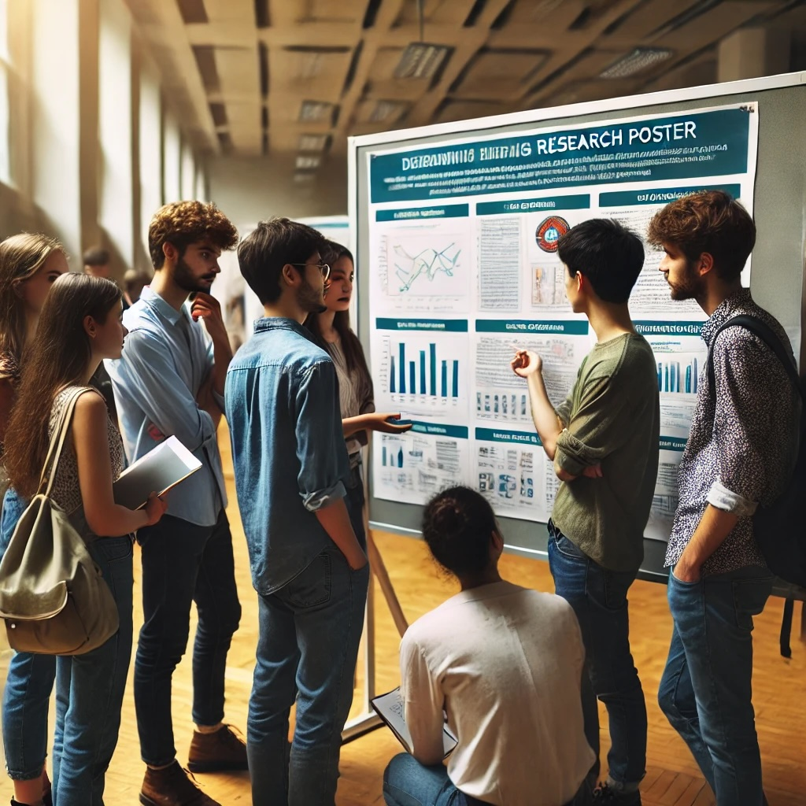

# Our Proposed Services

<!-- Remove the explicit h1 heading if present -->
<!-- # Our Proposed Services -->

<table class="services-table">
<tr>
<td>

### Informal Research Gatherings

Our informal sessions are all about students getting to know one another. Students gather together in a classroom to discuss the work that they've been doing. Students can ask questions and meet new classmates. 

</td>
<td>

### Formal Events

Formal events bring together students and faculty to share their work. Faculty can present their work and attract the attention of students. Students can share their interests and express their interest in working as a research assistant for a professor. Larger scale events such as meet and greets can eventually be run. 

</td>
</tr>
<tr>
<td>

### Workshops

Workshops can be run in order to teach students how to effectively conduct economic research. Some potential ideas for workshops could be:

  1. Introduction to Programming.
  2. How to Conduct a Literature Review. 
  3. How to Read an Economics Paper.

</td>
<td>

### Paper Replications (Hands-on Projects)

<em> Imitation is the sincerest form of flattery that mediocrity can pay to greatness - Oscar Wilde. </em>

\br

Students can get hands on experience by performing paper replications. Student leaders can get a chance to demonstrate their work. 

</td>
</tr>
</table>
