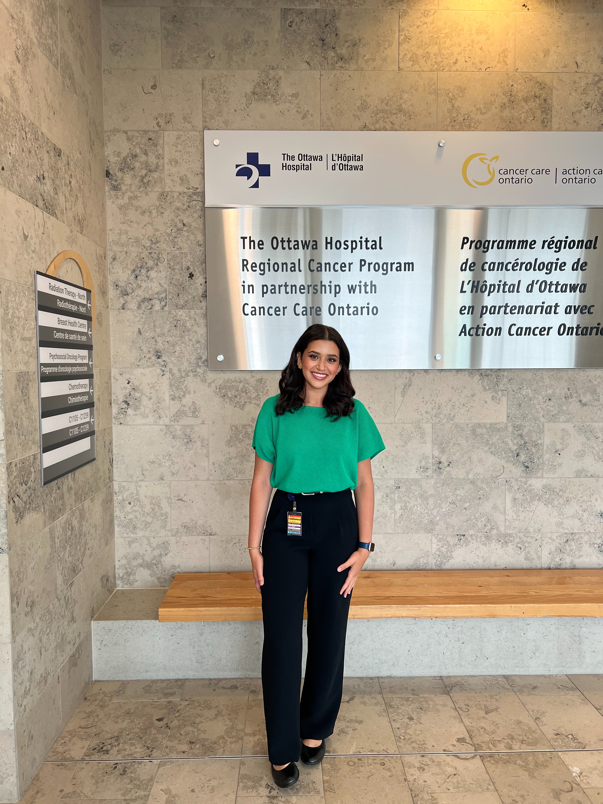
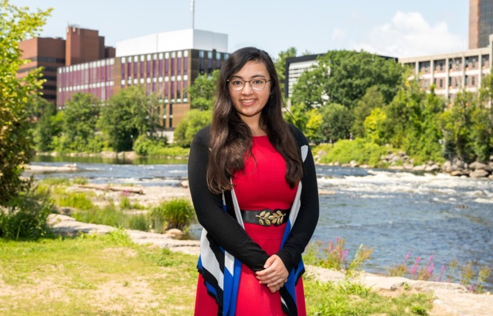

<!-- Team Members -->

|  |  |  |
| --- | --- | --- |
| Nora Abdelsamie B.ECON 3rd Year Concentration in Data Science and minor in Health Science | Ezra Brunet-Jailly MA Economics &nbsp; | Nam Chu B.MATH 3rd Year Combined Honours in Statistics and Economics |

|  |  |
| --- | --- |
| Anne-Shirley Desjardins B.ECON 3rd Year Triple Concentrations in Finance, Statistics, and Economic Theory | Abigail Meloche B.ECON 4th Year Concentration in Mathematics and Quantitative Economics |
